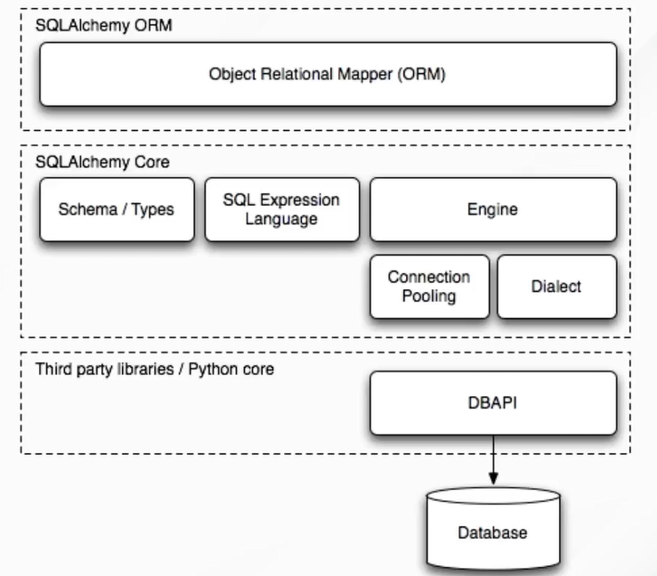

# 🐍 Python: SQLAlchemy ORM - Notes


## What is ORM?


### Object-Relational Impedance Mismatch


The **Object-Relational Impedance Mismatch** happens because the **relational** data model (tables and rows) is fundamentally different from the **object-oriented** model (classes and objects). ORM works to fix this incompatibility.


The **main difficulties** caused by these differences are:


* **Data Representation:** Distinct structures between tables and objects.

* **Type Mapping:** Converting data types between the programming language (Python) and the database (SQL) types.

* **Relational Integrity:** Adapting the relational database's integrity rules.


**ORM (Object-Relational Mapping)** is a technique that uses libraries and frameworks to **bridge the gap** between object-oriented applications and relational databases, allowing you to manage the database using objects from your language.


## ORM Patterns


There are two main patterns for implementing ORMs:


* **Data Mapper:**


  * The class representing the table (**model**) **does not** know the persistence methods (insert, update, delete).

  * These methods are delegated to a separate ORM class, ensuring the model has a **single responsibility**.


* **Active Record:**

  * The class representing the table **knows** and **has** the persistence methods (usually by inheriting a base class), mixing domain logic and persistence logic.


## What is SQLAlchemy?


**SQLAlchemy** is a **SQL toolkit for Python** and an **ORM** that offers the flexibility and power of SQL.


It is known for providing a complete set of enterprise-level persistence patterns, focusing on **efficient access** and **high performance** to databases, all through a simple and **"Pythonic"** domain language.


## Architecture





SQLAlchemy's architecture is divided into two main components:


1. **SQLAlchemy Core (The SQL "Engine"):**

    * **Lower Abstraction Level.**

    * Provides the **Expression Language** for building SQL queries programmatically.

    * Includes database **Dialects** (to translate code to pure database-specific SQL), **Connection Pooling**, and the **Engine** (the starting point for any SQLAlchemy application).

    * Can be used **independently of the ORM**.


1.  **SQLAlchemy ORM (The "Object Mapper"):**

     * **Higher Abstraction Level.**

     * Allows mapping Python classes to database tables, managing the database using Python **objects**.

     * Uses the **Core** to execute the SQL operations.


## Key Features


* **Components:** Core is ORM-independent, offering advanced SQL abstraction.

* **Performance:** Continuous optimization for efficient queries and **high performance**.

* **Flexibility:** Modular configuration, non-intrusive architecture, and **flexible mappings**.

* **Advanced Features:** Support for **Unit of Work**, class **Inheritance**, **Raw SQL**, **Caching**, and **Eager Loading** (optimized loading of relationships).

* **Comprehensive Support:** Compatible with various platforms and **databases** (PostgreSQL, MySQL, SQLite, Oracle, etc.).


## ORM Code Example: Model Definition and Insertion


This example shows how the Python `User` class is mapped to a database table and how a new object (user) is inserted.


```python

from sqlalchemy import create_engine, Column, Integer, String

from sqlalchemy.orm import sessionmaker, declarative_base


# 1. Core Configuration: Engine Creation

# Connects to an in-memory SQLite database

engine = create_engine('sqlite:///:memory:')


# 2. ORM Configuration: Declarative Base

# Base class from which all model classes will inherit

Base = declarative_base()


# 3. Model Definition (Object-Relational Mapping)

class User(Base):

    __tablename__ = 'users'

    id = Column(Integer, primary_key=True)

    name = Column(String)

    email = Column(String)


    def __repr__(self):

        return f"User(id={self.id!r}, name={self.name!r})"


# Creates the tables in the database

Base.metadata.create_all(engine)


# 4. Session Creation (Unit of Work)

# Session is the communication point between objects and the database

Session = sessionmaker(bind=engine)

session = Session()


# 5. Object Operations (Insertion)

# Instantiate a Python object

new_user = User(name='Stela', email='stela@example.com')


# Add the object to the session (prepares the operation)

session.add(new_user)


# Commit the transaction (sends the operation to the database)

session.commit()


# Query example (finds the inserted user)

retrieved_user = session.query(User).filter_by(name='Stela').first()

print(retrieved_user)

# Expected Output: User(id=1, name='Stela') 


session.close()

```
---
Thanks for reading! :heart:
